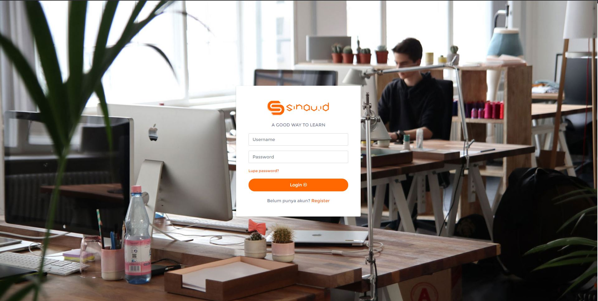
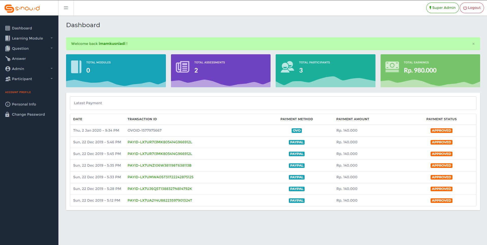
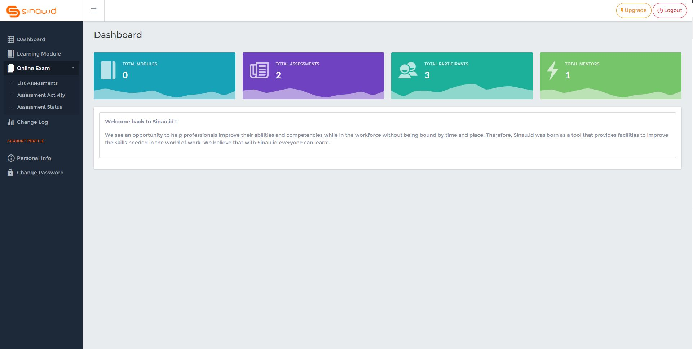
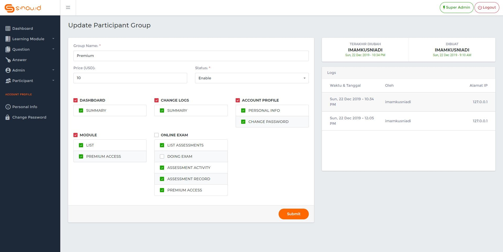
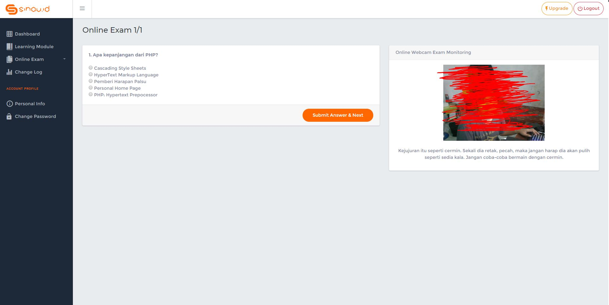
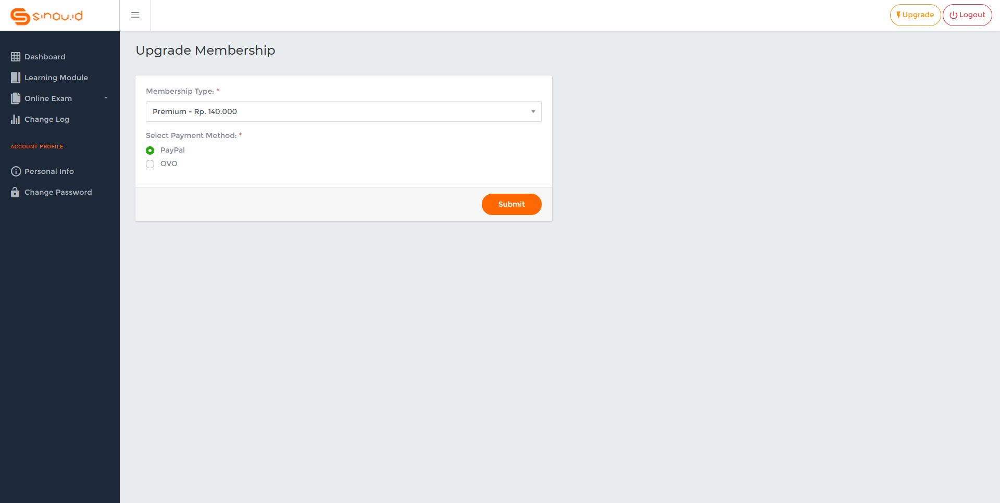
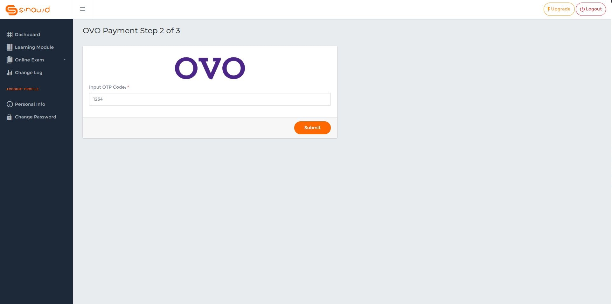

# Sinau ID - A good way to learn
Sinau.id merupakan sebuah platform eLearning berbasis website. Sinau.id memberikan fitur reguler dan premium untuk penggunanya. Pada Sinau.id pengguna dapat mempelajari modul - modul secara gratis maupun berbayar dan melaukan ujian secara online untuk mengetahui seberapa banyak materi yang telah dikuasai. Sinau.id dilengkapi sistem untuk 
menghalau kecurangan didalam ujian secara online dengan memanfaatkan ***Kecerdasan Buatan*** lebih tepatnya dengan teknologi ***Face Recognition***.

Dibangun dengan PHP Native (***Just another simple application***)

Developed by :
- Imam Kusniadi (17.11.1341)
- Mahmuddin Faqih A (17.11.1399)
- Mahmud Zakaria A (17.11.1356)
- Boy Candra W (17.11.1378)

### Donate
- Jika proyek ini sangat membantu anda untuk pengembangan aplikasi dan anda ingin mendukung saya, Anda dapat memberi saya secangkir kopi :)
- 

## Demo Website
https://sinauid.xhat.io

## Anti-Cheating Technology
Dengan menerapkan teknologi Face Recognition (AI Computer Vision) website yang kami buwat dapat mendeteksi kecurangan pada saat ujian secara online berjalan. Teknologi Face Recognition yang kami gunakan untuk mendeteksi kecurangan ini merupakan salah satu fitur yang dimiliki oleh FaceAI (https://faceai.id), kami menggunakan fitur face comparingnya sebagai dasar anti-cheating aplikasi ini. ***Big thanks for FaceAI :)***

## Supported Payment Method
Sinau.id sendiri memiliki fitur pembayaran dengan teknologi fintech terbarukan saat ini.

- PayPal

        Payment Send To
        sinkaj42@gmail.com

        Sandbox Test Account
        Personal: sb-4sdoa782493@personal.example.com
        Business: sb-d643gi783512@business.example.com

- OVO

        Payment Send To
        082334118***

## Screenshot
***Gambar 1. Homepage***

***Gambar 2. Login***

***Gambar 3. Admin Dashboard***

***Gambar 4. Participant Dashboard***

***Gambar 5. Dynamic Management with Log Activity Record***

***Gambar 6. Anti-Cheating Online Exam***

***Gambar 7. Participant Account Upgrade***

***Gambar 8. Support OVO Payment Method***

## Disclaimer

***Note: modifications, changes, or alterations to this sourcecode is acceptable, however,any public releases utilizing this code must be approved by writen this application.***
